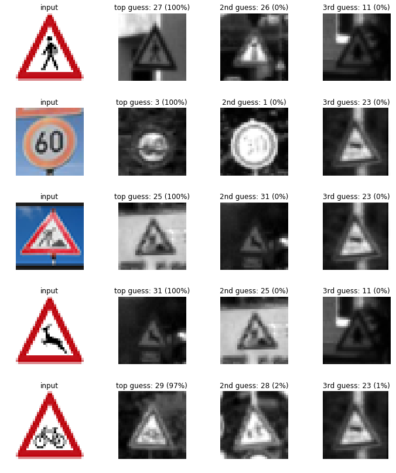

# **Traffic Sign Recognition** 

## Writeup

### You can use this file as a template for your writeup if you want to submit it as a markdown file, but feel free to use some other method and submit a pdf if you prefer.

**Build a Traffic Sign Recognition Project**

The goals / steps of this project are the following:
* Load the data set (see below for links to the project data set)
* Explore, summarize and visualize the data set
* Design, train and test a model architecture
* Use the model to make predictions on new images
* Analyze the softmax probabilities of the new images
* Summarize the results with a written report

[//]: # (Image References)

[image1]: ./examples/visualization.jpg "Visualization"
[image2]: ./examples/grayscale.jpg "Grayscaling"
[image3]: ./examples/random_noise.jpg "Random Noise"
[image4]: ./examples/placeholder.png "Traffic Sign 1"
[image5]: ./examples/placeholder.png "Traffic Sign 2"
[image6]: ./examples/placeholder.png "Traffic Sign 3"
[image7]: ./examples/placeholder.png "Traffic Sign 4"
[image8]: ./examples/placeholder.png "Traffic Sign 5"

## Rubric Points
### Here I will consider the [rubric points](https://review.udacity.com/#!/rubrics/481/view) individually and describe how I addressed each point in my implementation.  

---
### Writeup / README

#### 1. Provide a Writeup / README that includes all the rubric points and how you addressed each one. You can submit your writeup as markdown or pdf. You can use this template as a guide for writing the report. The submission includes the project code.

You're reading it! and here is a link to my [project code](https://github.com/udacity/CarND-Traffic-Sign-Classifier-Project/blob/master/Traffic_Sign_Classifier.ipynb)

### Data Set Summary & Exploration

#### 1. Provide a basic summary of the data set. In the code, the analysis should be done using python, numpy and/or pandas methods rather than hardcoding results manually.

I used the pandas and numpy library to calculate summary statistics of the traffic
signs data set:

* The size of training set is ? 34799
* The size of the validation set is ? 4410
* The size of test set is ? 12630
* The shape of a traffic sign image is ? (32,32,3)
* The number of unique classes/labels in the data set is ? 43

#### 2. Include an exploratory visualization of the dataset.

Here is an exploratory visualization of the data set. It is a bar chart showing how the data is distributed in terms of number of samples per traffic sign name. 

### Design and Test a Model Architecture

#### 1. Describe how you preprocessed the image data. What techniques were chosen and why did you choose these techniques? Consider including images showing the output of each preprocessing technique. Pre-processing refers to techniques such as converting to grayscale, normalization, etc. (OPTIONAL: As described in the "Stand Out Suggestions" part of the rubric, if you generated additional data for training, describe why you decided to generate additional data, how you generated the data, and provide example images of the additional data. Then describe the characteristics of the augmented training set like number of images in the set, number of images for each class, etc.)

As a first step, I decided to convert the images to grayscale because as mentioned in the LeNet paper, it increases the speed ot the training model.

Here is an example of a traffic sign image before and after grayscaling.

I then normalized the image data between [-1,1] to reduce the data mean value from approximately 82 to -0.32. By reducing the gaussian mean value we can get a better training results by converging the weighting values during packpropagation in NN, specialy when using a single learning rate value. 

I also tried to generate additional data to reduce the overfitting of my training to validation and test accuracy in addition to grayscale and normalization. 

The function img_translate(img) shows the technique used from cv2 library the warpAffine method to translate the selected images 4 pixels in x and y direction. 
I applied this translation to images for which their number of class were less than 800 and therefore augmented to 800 as it is shown in the next historgram figure.

Here is an example of an original image and an augmented image:

Here is the histogram of the augmented image class numbers:

 

#### 2. Describe what your final model architecture looks like including model type, layers, layer sizes, connectivity, etc.) Consider including a diagram and/or table describing the final model.

The Convolutional Neural Networks (CNN) are an efficient way to process and classify very large image data. The convolution technique uses a filter that is smaller than the input image surface (height x width) and multiplies each filter cell with the corresponding input image cell and adds up to the next cells multiplication. In doing so, we reduce the input image surface that is covered by filter size to only one output cell. The filter moves over the entire image height and width by selecting a stride value. At the end we add a bias term that is equal to the number of filter's channel. The values inside the filter are the product of the backpropagation in the neural net process. CNN reduces the number of weights and bias terms and they are shared across all patches in a gived input layer. 

In addition to filter multiplication technique there is also the pooling techinque that reduces the number of pixels (max or average pooling). The max pool uses again a filter and instead of multiplying to the input image it selects the maximum value of the input image within that filter size and stride over the entire image. The average pooling uses the average of the input image with that filter size.

RELU is the activation function that eliminates all negative inputs and reduces the positive input values with a given slope. 

My final model is the LeNet architechture that is consisted of the following layers:

| Layer         		|     Description	        					| 
|:---------------------:|:---------------------------------------------:| 
| Input         		| 32x32x1 Gray image   							| 
| Convolution     	| 5x5 filter with 1x1 stride, valid padding, outputs 28x28x6 	|
| RELU					|												|
| Max pooling	      	| ksize 2x2, stride 2x2,valid padding, outputs 14x14x16 				|
| Convolution 	    | 5x5 filter with 1x1 stride, valid padding, outputs 10x10x16     									|
| RELU		|       									|
| Max pooling			| ksize 2x2, stride 2x2,valid padding, outputs 5x5x16       									|
|				Flatten	|	Input = 5x5x16. Output = 400											|
|		Dropout				|	keep_prob:0.5											|
|    Fully Connected               |   Input = 400. Output = 120    |
| RELU| |
| Fully Connected| Input = 120. Output = 84|
| RELU| |
| Fully Connected|Input = 84. Output = 43 | 

#### 3. Describe how you trained your model. The discussion can include the type of optimizer, the batch size, number of epochs and any hyperparameters such as learning rate.

I trained my model using the following hyperparameters-

Epochs - 50

Batch Size - 128

Learning Rate - 0.0009

Optimizer- AdamOptimizer

mu - 0

sigma - 0.1

dropout keep probability - 0.5

#### 4. Describe the approach taken for finding a solution and getting the validation set accuracy to be at least 0.93. Include in the discussion the results on the training, validation and test sets and where in the code these were calculated. Your approach may have been an iterative process, in which case, outline the steps you took to get to the final solution and why you chose those steps. Perhaps your solution involved an already well known implementation or architecture. In this case, discuss why you think the architecture is suitable for the current problem.

My final model results were:
* training set accuracy of ? 99.9%
* validation set accuracy of ? 94.5%
* test set accuracy of ? 93.3%

The following steps describe the approaches I took to increase the accuracy of my validation set and test result.

I first ran the model with batch size: 128, epochs: 10, rate: 0.001, mu: 0, sigma: 0.1. Keeping the mu and sigma always constant, I gradually increased the epochs size to 50, and 60 and also reduced the learning rate to 0.0008 and 0.0009. Results showed a higher validation accuracy for epochs 50 and learning rate 0.0009.However, there was still overfitting so I introduced the dropout with a keep_prob of 0.5 and this increased the validation accuracy by about 2% reducing the overfitting and producing about 100% image data classificaiton with the model saved as ./lenet.

However I also tried image augmentation with function img_translate(img) using the warpAffine technique from cv2 library. The model was saved in ./lenetAug. Eventhough the overfitting was slightly reduced, however the end result for image classificaiton was reduced to 20%!   

Below is a history of my activity for hyperparameter selection:

2020-07-09 - validation accuracy=88.5% preprocessing: grayscale, normalization model: original LeNet, batch size: 128, epochs: 10, rate: 0.001, mu: 0, sigma: 0.1

2020-07-09 - 94.0% preprocessing: grayscale, normalization model: original LeNet, batch size: 128, epochs: 50, rate: 0.0008, mu: 0, sigma: 0.1

2020-07-09 - 92.0% preprocessing: grayscale, normalization model: original LeNet, batch size: 128, epochs: 60, rate: 0.0009, mu: 0, sigma: 0.1

2020-07-09 - 93.9% preprocessing: grayscale, normalization model: original LeNet, batch size: 100, epochs: 50, rate: 0.0009, mu: 0, sigma: 0.1

2020-07-09 - 93.3% preprocessing: grayscale, normalization model: original LeNet, batch size: 100, epochs: 60, rate: 0.0009, mu: 0, sigma: 0.1

2020-07-09 - 94.5% preprocessing: grayscale, normalization model: original LeNet, batch size: 128, epochs: 50, rate: 0.001, mu: 0, sigma: 0.1

2020-07-16 - 91.1% preprocessing: grayscale, normalization model: original LeNet, batch size: 128, epochs: 50, rate: 0.0009, mu: 0, sigma: 0.1

2020-07-16 - 93.5% --> Even though the same hyperparameters as the last run on (2020-07-09 - 94.5%) were used since we randomly initiate the weights (tf.truncated_normal) there is up to 1% of accuracy change difference. preprocessing: grayscale, normalization model: original LeNet, batch size: 128, epochs: 50, rate: 0.001, mu: 0, sigma: 0.1

2020-07-16 - 95.5 % --> Introduced droupout preprocessing: grayscale, normalization model: original LeNet, batch size: 128, epochs: 50, rate: 0.001, mu: 0, sigma: 0.1, keep_dropout = 0.5

2020-07-16 - 96.4 % --> Same droupout (0.5) and reduced learning rate from 0.001 to 0.0009 preprocessing: grayscale, normalization model: original LeNet, batch size: 128, epochs: 50, rate: 0.0009, mu: 0, sigma: 0.1, keep_dropout = 0.5

2020-07-18 - Validation accuracy 95.6 %, Trainig accuracy 99.9% (There is overfitting, needs some more data, perhaps data augmentation would help reduce the validation error and get closer to training accuracy) model saved into ./model.ckpt --> Same droupout (0.5) and reduced learning rate from 0.001 to 0.0009 preprocessing: grayscale, normalization model: original LeNet, batch size: 128, epochs: 50, rate: 0.0009, mu: 0, sigma: 0.1, keep_dropout = 0.5

2020-07-18 - Introduced augmentation technique (image translation for the training set) for images less than 800 samples and increased their number to 800. Validation accuracy 95.3 %, Trainig accuracy 99.7% , there is still overfitting, the test accuracy is 94 % --> Same droupout (0.5) and reduced learning rate from 0.001 to 0.0009 preprocessing: grayscale, normalization, image augmentation model: original LeNet, batch size: 128, epochs: 50, rate: 0.0009, mu: 0, sigma: 0.1, keep_dropout = 0.5 model saved into ./model2.ckpt

2020-07-19 - ./lenet model used without data augmentation. Validation accuracy 96.0 %, Trainig accuracy 99.8%, Test accuracy 94.5%, on Test image 1.00 = 100% !! preprocessing: grayscale, normalization model: original LeNet, batch size: 128, epochs: 50, rate: 0.0009, mu: 0, sigma: 0.1, keep_dropout = 0.5 I did not save acopy in HTML

ANother run for the same ./lenet model on 2020-07-31 --> Validation accuracy 94.5 %, Trainig accuracy 99.9%, test accuracy 93.3%, on the test image set: 80%

2020-08-02 Augmented data test run and saved into ./lenetAug --> Validation accuracy 95.5 %, Trainig accuracy 99.7%, test accuracy 93.9%, on the test image set: 20%

preprocessing: grayscale, normalization, data augmentation model: original LeNet, batch size: 128, epochs: 50, rate: 0.0009, mu: 0, sigma: 0.1, keep_dropout = 0.5

ANother run for the same ./lenet model on 2020-08-09 --> Validation accuracy 95.6 %, Trainig accuracy 99.8%, test accuracy 94.9%, on the test image set: 80%

If an iterative approach was chosen:
* What was the first architecture that was tried and why was it chosen? Lenet
* What were some problems with the initial architecture? Overfitting
* How was the architecture adjusted and why was it adjusted? 
The problem with the LeNet architecture was that the final output it returned was 10 classes. Since we require here 43 classes so the corresponding layers were updated
I also introduced dropout. 
 

### Test a Model on New Images

#### 1. Choose five German traffic signs found on the web and provide them in the report. For each image, discuss what quality or qualities might be difficult to classify.

Here are five German traffic signs that I found on the web:

There is not a big difference in the images that would affect the classification. However, maybe there are some differences in brightness in general, my images are more bright than what the model was trained on a different spectrum. Also, the German dataset states that the images "contain a border of 10 % around the actual traffic sign to allow for edge-based approaches" and the images that I used do not all include such a border. This could be another source of confusion for the model.

#### 2. Discuss the model's predictions on these new traffic signs and compare the results to predicting on the test set. At a minimum, discuss what the predictions were, the accuracy on these new predictions, and compare the accuracy to the accuracy on the test set (OPTIONAL: Discuss the results in more detail as described in the "Stand Out Suggestions" part of the rubric).

Here are the results of the prediction:

1. Ran the first time (Traffic_Sign_Classifier_lenet_2020_07_19.html), I got 100% comapred to Test accuracy of 94.5% during the first model run. So it was outperforming on the new dataset.

1. Ran the same lenet model another time (Traffic_Sign_Classifier_lenet_2020_08_09.html), I got 80% compared to Test accuracy of 94.9% .

#### 3. Describe how certain the model is when predicting on each of the five new images by looking at the softmax probabilities for each prediction. Provide the top 5 softmax probabilities for each image along with the sign type of each probability. (OPTIONAL: as described in the "Stand Out Suggestions" part of the rubric, visualizations can also be provided such as bar charts)

The code for making predictions on my final model is located in the 11th cell of the Ipython notebook.

The probabilities are shown as a histogram graph, and the order of image is the same as the image above.

Without augmentation technique:

INFO:tensorflow:Restoring parameters from ./lenet
TopKV2(values=array([[  6.57469690e-01,   3.42530280e-01,   1.84662807e-09,
          2.43860210e-11,   1.54945707e-12],
       [  9.99937296e-01,   5.04215095e-05,   9.49314745e-06,
          1.42259375e-06,   7.21070251e-07],
       [  9.99240518e-01,   6.81219331e-04,   4.72704160e-05,
          1.31633260e-05,   7.64287233e-06],
       [  9.99272645e-01,   7.22126802e-04,   5.24147345e-06,
          1.54126649e-08,   1.80692804e-11],
       [  9.99304771e-01,   6.88007509e-04,   7.10949371e-06,
          9.32535471e-08,   4.78545115e-09]], dtype=float32), indices=array([
       [11, 27, 28, 26, 18],
       [ 3,  5,  2,  1, 40],
       [25, 18, 22, 24, 37],
       [31, 25, 22, 21, 23],
       [29, 22, 28, 23, 30]], dtype=int32))

With augmentation technique

INFO:tensorflow:Restoring parameters from ./lenetAug
TopKV2(values=array([[  9.59321916e-01,   3.73094976e-02,   2.55020289e-03,
          8.18355824e-04,   2.96584313e-09],
       [  9.99886155e-01,   4.58276518e-05,   4.17626979e-05,
          1.57029790e-05,   6.42101122e-06],
       [  3.82100016e-01,   2.86277950e-01,   2.45966524e-01,
          6.47762641e-02,   1.80931333e-02],
       [  9.62702036e-01,   3.62823755e-02,   9.78107098e-04,
          3.42134408e-05,   3.08855601e-06],
       [  9.59442794e-01,   4.05572131e-02,   3.39038451e-08,
          3.82708101e-11,   5.94803980e-12]], dtype=float32), indices=array([
       [18, 27, 26, 11, 24],
       [ 0, 25, 22,  2,  3],
       [20, 22, 25,  0, 23],
       [31, 23, 21, 22, 20],
       [22, 29, 24, 25, 30]], dtype=int32))

Improvement: for augmentation technique, in addition to image translation method, I need to make additional computer vision techniques such as perspective transforms and brightness methods to make the augmented data more diverse for beter image classificaiton accuracy. 